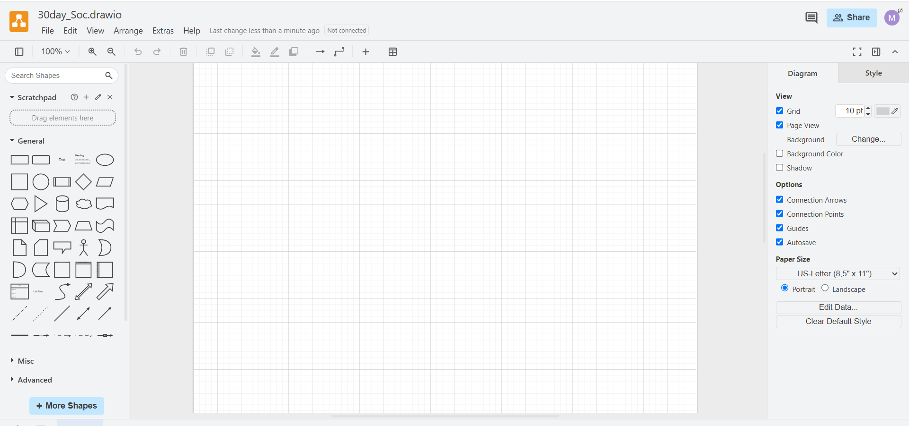
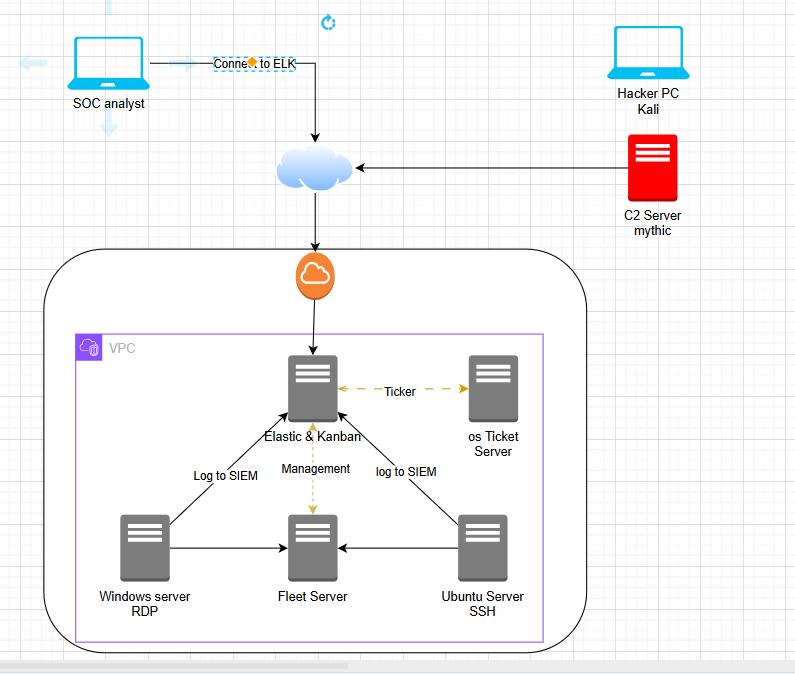

# Logical Digtram

Now we need to start to draw logical digram for the network that we will create for this will used draw.io  
[draw.io](draw.io), it is easy way to create digarm any one could used.

now let's desgin smaple network with 6 server, 5 to internal network and one as C2, also two PC one for Analyst and another one for hacker.

This all we need to do in day one.